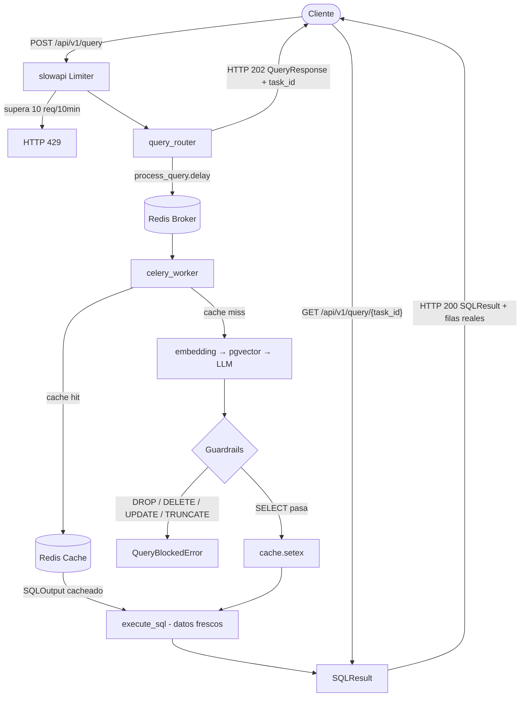

# Text to SQL with Guardrails

**Cualquier persona de negocio puede obtener información de su base de datos escribiendo en lenguaje natural — sin saber SQL, sin depender de un equipo técnico.**

Un CEO que quiere saber qué sucursal facturó más este mes, un equipo de marketing que necesita segmentar clientes, un analista financiero buscando tendencias — todos pueden hacer esas preguntas directamente. El sistema las convierte en SQL seguro, lo valida y devuelve los resultados.

**Y no solo personas: la misma API es una tool que un agente de IA puede llamar** cuando necesita datos de una base de datos para completar su tarea.

   

---

## El problema que resuelve

En la mayoría de las empresas, obtener datos de negocio requiere abrir un ticket al equipo técnico, esperar, y recibir una query que quizás no era exactamente lo que se necesitaba. Este sistema elimina ese cuello de botella.

---

## Dos consumidores: personas y agentes de IA

El sistema expone una API HTTP simple (`POST /query` → polling del resultado). Eso lo hace consumible por dos tipos de cliente:

- **Personas** — a través del frontend, escribiendo preguntas en lenguaje natural.
- **Agentes de IA** — un agente autónomo que encadena herramientas para resolver una tarea puede registrar este servicio como una de sus *tools*. Cuando necesita un dato que vive en una base de datos, llama a la API en lenguaje natural y recibe un resultado estructurado y validado para su siguiente paso de razonamiento.

Y es justo en el caso del agente donde **los guardrails dejan de ser un lujo y pasan a ser críticos**: un agente generando SQL sin supervisión humana es exactamente el escenario donde un `DROP TABLE` accidental hace daño real. La seguridad por construcción de este sistema convierte un Text-to-SQL en una tool que podés exponer a un agente sin miedo — y cada tool call queda trazada en LangSmith.

---

## Por qué funciona mejor que un Text-to-SQL naive

El diferencial está en **cómo se construye el contexto que recibe el LLM**.

Un sistema naive le pasa el schema SQL crudo al modelo — nombres de tablas y columnas en inglés técnico, sin contexto de negocio. El resultado son queries incorrectas, columnas alucinadas, JOINs equivocados.

Este sistema construye un knowledge base de tres capas antes de cada generación:

| Capa | Qué aporta |
|---|---|
| **Schema semántico** | Cada tabla descrita con sinónimos en lenguaje natural. `branches` = sucursal, tienda, local, outlet. El LLM entiende lo que el usuario realmente pregunta. |
| **Patrones de JOIN** | Cómo combinar tablas para casos de negocio reales. "Ventas por país" → `orders → branches → cities → countries`. No hay que inferirlo. |
| **Few-shot examples** | Pares pregunta→SQL resueltos del dominio real. El modelo aprende el patrón correcto con ejemplos concretos. |

Este enfoque fue el cambio más significativo del proyecto: pasó de generar queries incorrectas a resolver consultas con 5 JOINs y GROUP BY sin fallos.

El knowledge base se carga con `POST /api/v1/admin/reindex-knowledge` y se actualiza periódicamente via Celery Beat.

---

## Seguridad por construcción

Ningún SQL destructivo puede ejecutarse — no por validación condicional, sino por arquitectura.

Los guardrails corren **antes** del cache y **antes** de la ejecución. Si alguno bloquea, el pipeline lanza `QueryBlockedError` y el `return` nunca se alcanza. No existe camino por donde un `DROP TABLE`, `DELETE` o `UPDATE` llegue a la base de datos del cliente.

El `GuardrailFactory` ejecuta tres validators en secuencia (se agregan nuevos sin tocar la capa de servicios):

- **`SqlValidator`** — bloquea operaciones destructivas (`DROP`, `DELETE`, `UPDATE`, `TRUNCATE`, `ALTER`, `INSERT`).
- **`SchemaValidator`** — bloquea queries que referencian tablas fuera del schema indexado.
- **`SensitiveDataValidator`** — bloquea acceso a datos sensibles (`password`, `salary`, `ssn`, etc.).

---

## Observabilidad real con LangSmith

Llevar un pipeline de IA a producción sin observabilidad es volar a ciegas. Sabés que algo falló, pero no dónde ni por qué.

Con LangSmith integrado, cada request genera un trace completo con todos los pasos visibles:

```
query-pipeline
├── cache-check        — ¿había SQL cacheado?
├── embedding          — vectorización de la pregunta
├── rag-retrieval      — qué chunks del knowledge base recuperó (cantidad + tablas)
├── sql-generation-chain                — input al LLM, output, tokens, costo, latencia
│     └── claude-haiku-4-5-20251001
├── guardrail-SqlValidator              — blocked: false
├── guardrail-SchemaValidator           — blocked: false
├── guardrail-SensitiveDataValidator    — blocked: "SQL accede a dato sensible: salary"
└── sql-execution      — cuántas filas devolvió
```

Cada run lleva inputs y outputs explícitos: `rag-retrieval` muestra cuántos chunks recuperó y de qué tablas, cada `guardrail-*` muestra el SQL evaluado y si bloqueó (con el motivo), y `sql-execution` muestra el `row_count`. Cuando un guardrail bloquea una query, LangSmith muestra exactamente qué SQL generó el LLM y por qué se bloqueó — sin buscar en logs.

La instrumentación está envuelta en `try/except` de punta a punta: **si LangSmith falla, el pipeline sigue corriendo**. La observabilidad nunca puede tumbar producción.

---

## Arquitectura

Una consulta entra por un endpoint HTTP con rate limiting, se encola como tarea Celery, pasa por validación de guardrails, se ejecuta contra la base de datos del cliente y devuelve filas reales via long polling.



7 capas estrictas: `api → services → integrations → guardrails → repositories → models → schemas`. Los services orquestan, los repositories acceden a storage, nunca al revés.

---

## Stack

| Componente | Rol |
|---|---|
| FastAPI + Celery | API async con procesamiento en background |
| PostgreSQL + pgvector | Storage interno y búsqueda vectorial del knowledge base |
| Redis | Broker de Celery, cache de SQL generado, contadores de rate limit |
| Gemini embeddings | Vectorización del knowledge base y de cada query (`gemini-embedding-001`) |
| Claude Haiku | Generación de SQL estructurado con Pydantic output |
| LangSmith | Observabilidad del pipeline completo |
| React + Vite | Frontend para consultas en lenguaje natural |

---

## Correr localmente

```bash
git clone <repo-url>
cd text-to-sql-guardrails
cp .env.example .env
# Completar GEMINI_API_KEY, ANTHROPIC_API_KEY, SECRET_KEY
# Opcional observabilidad: LANGCHAIN_API_KEY (si está vacío, el pipeline corre igual)

docker compose up --build                 # backend: API + Celery + PostgreSQL + Redis
docker compose --profile dev up --build   # + frontend React con HMR
```

Primer deploy — ejecutar en orden desde `/docs` (idempotentes):
```
POST /api/v1/admin/seed-client       → carga datos de prueba en la DB del cliente
POST /api/v1/admin/reindex-schema    → indexa el schema de la DB en pgvector
POST /api/v1/admin/reindex-knowledge → indexa el knowledge base (joins, few-shots)
```

---

## Variables de Entorno

| Variable | Descripción | Requerida |
|---|---|---|
| `DATABASE_URL` | PostgreSQL interna (historial de queries y embeddings). Formato asyncpg | Sí |
| `CLIENT_DATABASE_URL` | PostgreSQL del cliente (datos de negocio consultados por `execute_sql`). Formato psycopg2 | Sí |
| `REDIS_URL` | Redis para broker Celery, cache SQL y rate limit | Sí |
| `GEMINI_API_KEY` | Google AI Studio — embeddings | Sí |
| `ANTHROPIC_API_KEY` | Anthropic — generación de SQL (Claude Haiku) | Sí |
| `SECRET_KEY` | Clave para signing interno | Sí |
| `LANGCHAIN_API_KEY` | LangSmith — observabilidad. Si está vacío, el pipeline corre sin trazas | No |
| `LANGCHAIN_PROJECT` | Proyecto de LangSmith donde aparecen los runs | No (default: `text-to-sql-guardrails`) |
| `EMBEDDING_MODEL` | Modelo de embeddings de Gemini | No (default: `models/gemini-embedding-001`) |
| `REINDEX_INTERVAL_SECONDS` | Frecuencia del re-indexado periódico | No (default: `86400`) |

> `CLIENT_DATABASE_URL` es la DB del cliente (sus datos de negocio); `DATABASE_URL` es la DB interna (`query_history` + embeddings de schema). Son distintas a propósito.

---

## Decisiones Técnicas Destacadas

1. **`SQLResult` no hereda de `SQLOutput`** — `SQLOutput` es el contrato con el LLM (cambia con el modelo o el prompt), `SQLResult` es el contrato HTTP (cambia con la evolución de la API). La herencia los acoplaría y un cambio de prompt rompería la respuesta HTTP en silencio.
2. **Cache hit ejecuta SQL fresco** — el string SQL es determinístico y se cachea; las filas de la DB del cliente no. Cachear resultados devolvería datos obsoletos.
3. **Redis como storage de slowapi, no memoria** — con contadores en memoria cada réplica tiene su propio límite, multiplicando la tasa permitida por el número de workers.
4. **`task_id` nunca llega al DOM** — vive solo en el closure del `setInterval`, evitando estado obsoleto si el componente se re-renderiza durante el polling.
5. **La posición de los guardrails garantiza el invariante** — corren antes de `cache.setex` y `execute_sql`, así ningún SQL destructivo se cachea ni se ejecuta, por construcción.
6. **La observabilidad no puede romper el pipeline** — toda la instrumentación de LangSmith está envuelta en `try/except`; si falla la captura de un trace, la query se resuelve igual.
7. **Entrypoint sin seed ni reindex** — deploy en ~30s. Seed y reindex se invocan una sola vez via endpoints admin tras el primer deploy.

---

## Roadmap

- Auth real en `admin_router` (API key o JWT service-to-service)
- Rate limiting por `user_id` además de por IP
- Paginación en `SQLResult.results` para queries con muchas filas
- Tests de carga del rate limiter en CI
